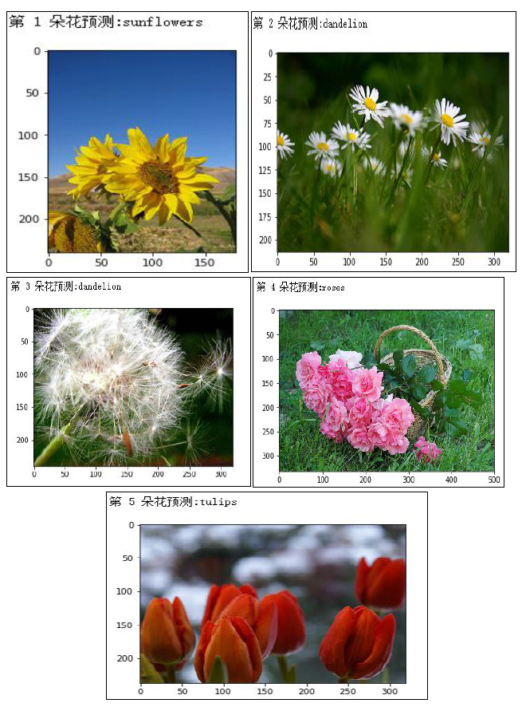

# flower-recognition-with-CNN
A simple experiment of deep learning which is used CNN to recognize flowers. This experiment is based on Tensorflow. The dataset can be obtained on Baidu Cloud Disk. Link：https://pan.baidu.com/s/10nvcL94zgpreQUaDSIsIGA?pwd=cnn2 Password：cnn2 

代码仅供参考

环境配置：

Python 3.7

Tensorflow 1.15

opencv 4.5.2

scikit-learn 0.21.3

测试结果：

